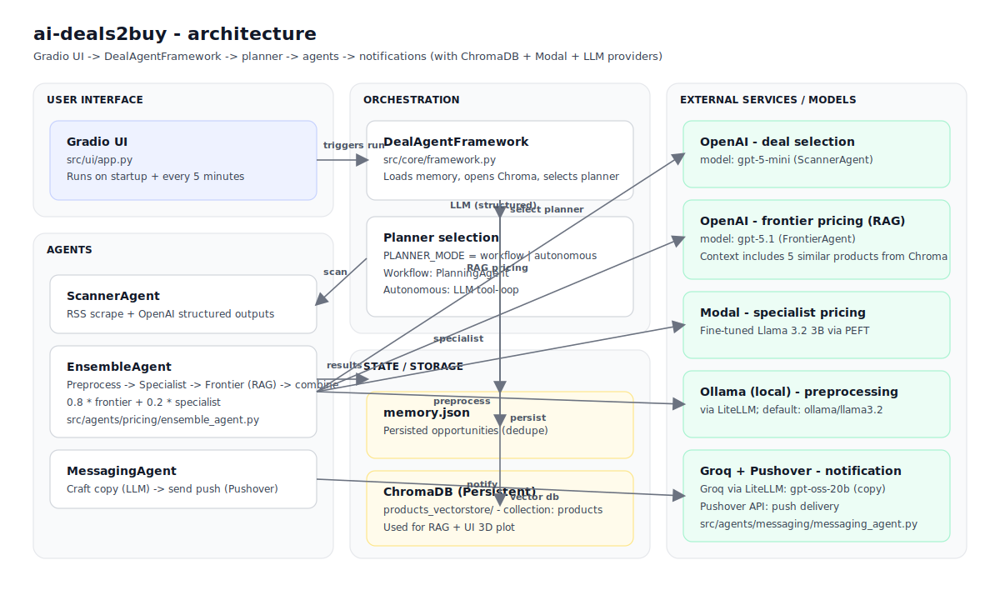
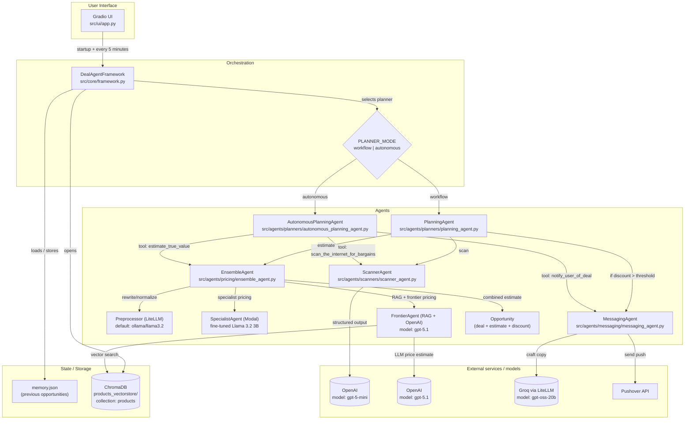

## System documentation — architecture + end-to-end flow

This document explains **what this repo does**, **how the agents cooperate**, and **which models/providers are invoked** at each step.

### Executive summary

The app is a periodic **deal-hunting agent system**:
- It scrapes a small set of RSS feeds (DealNews).
- An LLM picks the “best 5” deals and normalizes them into structured JSON (description, price, URL).
- An **ensemble price estimator** computes an “estimated true value” for each deal using:
  - a **fine-tuned specialist model** hosted on Modal
  - a **frontier LLM** grounded by **RAG** over a Chroma vector DB of products
  - (optional) a preprocessing LLM that rewrites/normalizes the product text first
- If the discount is large enough, it crafts a short notification message via an LLM and sends it via Pushover.
- It persists results in `memory.json` to avoid re-alerting on the same deals.

### High-level architecture (Mermaid)

Rendered image (GitHub-friendly):





### Runtime flow (what happens end-to-end)

#### 1) App boot

- `src/main.py`
  - loads `.env` (`python-dotenv`)
  - truncates `memory.json` to the first 2 entries (via `DealAgentFramework.reset_memory()`)
  - optionally builds the vector DB (`--build-vectordb`)
  - launches the Gradio UI (`App().run()`)

#### 2) UI triggers a run

- `src/ui/app.py` sets a timer:
  - **startup**: run immediately when the UI loads
  - **periodic**: every 300 seconds (5 minutes)

The UI also shows:
- a table of found opportunities (price, estimate, discount, URL)
- a 3D plot of product embeddings from Chroma (t-SNE projection)
- streaming logs (reformatted ANSI → HTML)

#### 3) Framework chooses the planning strategy

- `src/core/framework.py` decides planner based on `PLANNER_MODE`:
  - **workflow**: `PlanningAgent`
  - **autonomous (default)**: `AutonomousPlanningAgent` (LLM tool-calling loop)

Both planners ultimately use the same capabilities:
- `ScannerAgent`: acquire and normalize deals
- `EnsembleAgent`: estimate “true value”
- `MessagingAgent`: notify user

#### 4) Deal acquisition (ScannerAgent)

- **Scrape**: `ScrapedDeal.fetch()` pulls entries from DealNews RSS feeds and then fetches each deal page to extract “Details” and “Features” HTML text (`feedparser`, `requests`, `beautifulsoup4`)
- **LLM selection**: `ScannerAgent` calls OpenAI **Structured Outputs** to produce a `DealSelection` (Pydantic schema)
  - **model**: `gpt-5-mini`
  - output: exactly 5 deals with a clear numeric price and a rewritten product description

#### 5) Price estimation (EnsembleAgent)

For each shortlisted deal, `EnsembleAgent.price()` does:

1) **Preprocess / rewrite** (optional but enabled in code)
   - `Preprocessor` uses `litellm.completion`
   - **default model**: `ollama/llama3.2` (local)
   - goal: normalize into Title/Category/Brand/Description/Details

2) **Specialist estimate (Modal)**
   - `SpecialistAgent` calls a Modal class `pricer-service.Pricer`
   - the Modal service loads a **fine-tuned** model:
     - **base**: `meta-llama/Llama-3.2-3B`
     - **fine-tune**: PEFT adapter `ed-donner/price-2025-11-28_18.47.07` (pinned revision in `src/services/modal/pricer_service*.py`)

3) **Frontier estimate (RAG + OpenAI)**
   - `FrontierAgent` embeds the rewritten text with SentenceTransformers (`all-MiniLM-L6-v2`)
   - retrieves 5 similar products from Chroma (`products_vectorstore`, collection `products`)
   - calls OpenAI with the deal description + retrieved examples to estimate a single price
     - **model**: `gpt-5.1`

4) **Combine**
   - current weighting: \(0.8 \cdot \text{frontier} + 0.2 \cdot \text{specialist}\)

#### 6) Notification (MessagingAgent)

- If a deal is compelling:
  - workflow mode checks `PlanningAgent.DEAL_THRESHOLD`
  - autonomous mode asks the planner LLM to call a “notify” tool once
- Message text is generated via `litellm` on Groq:
  - **model**: `groq/openai/gpt-oss-20b`
- Delivery uses **Pushover** HTTP API (`requests`)

#### 7) Persistence + visualization

- `memory.json` is appended with the best surfaced opportunity (if any)
- The 3D plot in the UI reads from Chroma and uses scikit-learn t-SNE
  - note: t-SNE default perplexity 30 ⇒ needs **at least 31 vectors**

### Vector DB build pipeline (products_vectorstore/)

The vector DB is built by `src/rag/vectorstore.py`:
- downloads an items dataset from HuggingFace (`datasets`)
  - default: `ed-donner/items_lite` (or `items_full`)
- embeds each item summary with SentenceTransformers `all-MiniLM-L6-v2`
- stores documents + embeddings + metadata `{category, price}` into ChromaDB (PersistentClient)

CLI entrypoints:

```bash
uv run python src/main.py --build-vectordb
uv run python src/main.py --build-vectordb --full-dataset
uv run python src/main.py --build-vectordb --force-recreate-vectordb
```

### Key configuration knobs

- **Planner**: `PLANNER_MODE=workflow|autonomous`
- **Preprocessor model**: `PRICER_PREPROCESSOR_MODEL` (default `ollama/llama3.2`)
- **HF dataset user**: `HF_DATASET_USER` (default `ed-donner`)
- **Notification credentials**: `PUSHOVER_USER`, `PUSHOVER_TOKEN`
- **LLM credentials**: `OPENAI_API_KEY`, `GROQ_API_KEY`

### Where to look in code

- `src/main.py`: entrypoint and CLI flags (`--build-vectordb`, `--full-dataset`, `--force-recreate-vectordb`)
- `src/ui/app.py`: Gradio UI + periodic execution + plots
- `src/core/framework.py`: planner selection + memory + vector DB + t-SNE plot data
- `src/agents/scanners/scanner_agent.py`: RSS → OpenAI structured deal selection (`gpt-5-mini`)
- `src/agents/pricing/ensemble_agent.py`: preprocessing + specialist + frontier combination
- `src/agents/pricing/frontier_agent.py`: RAG over Chroma + OpenAI price estimate (`gpt-5.1`)
- `src/agents/pricing/specialist_agent.py`: Modal RPC to fine-tuned Llama service
- `src/agents/messaging/messaging_agent.py`: Groq message crafting + Pushover send
- `src/rag/vectorstore.py`: builds the Chroma vector store from HF datasets

### Directory structure and responsibilities (current)

This is the “ideal” AI-project layout used in `src/`. Some legacy modules remain as **compatibility shims** to avoid breaking old imports; shims are thin re-exports and can be deleted later once you’ve updated all downstream references.

- **`src/main.py`**: CLI entrypoint. Loads env, optionally builds vector DB, launches Gradio UI.

- **`src/ui/`**: Gradio UI layer.
  - `src/ui/app.py`: UI + timer-driven execution + table/logs/plot rendering.
  - `src/price_is_right.py`: **shim** for backward compatibility (`App` re-export).

- **`src/core/`**: orchestration + app framework.
  - `src/core/framework.py`: `DealAgentFramework` (planner selection, Chroma wiring, run loop).
  - `src/core/memory.py`: `MemoryStore` (read/write/reset `memory.json`).
  - `src/deal_agent_framework.py`: **shim** (`DealAgentFramework` re-export).

- **`src/agents/`**: agent implementations (grouped by capability).
  - `src/agents/base.py`: base `Agent` logging utilities.
  - `src/agents/planners/`: workflow vs LLM tool-loop planners.
  - `src/agents/scanners/`: deal ingestion + LLM deal selection.
  - `src/agents/pricing/`: ensemble + frontier (RAG) + specialist (Modal) + optional NN estimator.
  - `src/agents/messaging/`: message crafting + notification orchestration.
  - `src/agents/preprocessing/`: text rewrite/normalization prior to pricing.
  - `src/agents/*.py` (flat files): mostly **shims** re-exporting the new grouped modules (kept for compatibility).

- **`src/data/`**: Pydantic models + dataset utilities.
  - `src/data/models.py`: `Deal`, `DealSelection`, `Opportunity`, `Item`, etc.

- **`src/scraping/`**: pure ingestion utilities (no model calls).
  - `src/scraping/rss_scraper.py`: DealNews RSS + deal page fetching into `ScrapedDeal`.
  - `src/scraping/html_parser.py`: BeautifulSoup helpers for cleaning RSS snippets.

- **`src/rag/`**: retrieval and vector store utilities.
  - `src/rag/vectorstore.py`: build/populate Chroma vector DB from HF datasets (used by `--build-vectordb`).
  - `src/rag/embeddings.py`: SentenceTransformer embedding helper/caching.
  - `src/rag/retriever.py`: Chroma retriever wrapper (used by `FrontierAgent`).

- **`src/models/`**: ML model definitions and evaluation utilities (non-agent).
  - `src/models/neural_network.py`: deep neural network + inference helper.
  - `src/models/evaluator.py`: evaluation utilities / plotting for model accuracy.

- **`src/services/`**: integrations with external services/providers (infra).
  - `src/services/modal/`: Modal app code for hosting the fine-tuned specialist model.
  - `src/services/notifications/pushover.py`: Pushover client wrapper.

- **`src/config/`**: centralized config/constants.
  - `src/config/settings.py`: env-backed `Settings` (lightweight).
  - `src/config/constants.py`: project constants (categories/colors).

- **`src/utils/`**: shared utilities.
  - `src/utils/logging.py`: ANSI → HTML log formatting used by UI.
  - `src/utils/visualization.py`: t-SNE plot-data computation helper.

- **`src/notebooks/`**: place for exploration notebooks.
  - `src/notebooks/README.md`: notes + suggested `git mv` for the legacy notebook.
  - `src/agents/results.ipynb`: legacy notebook location (planned to move here).

